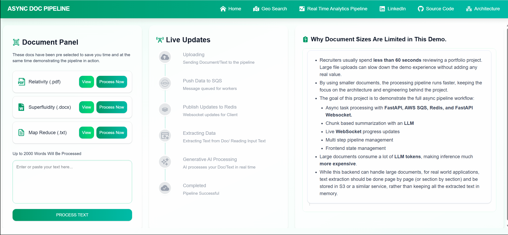
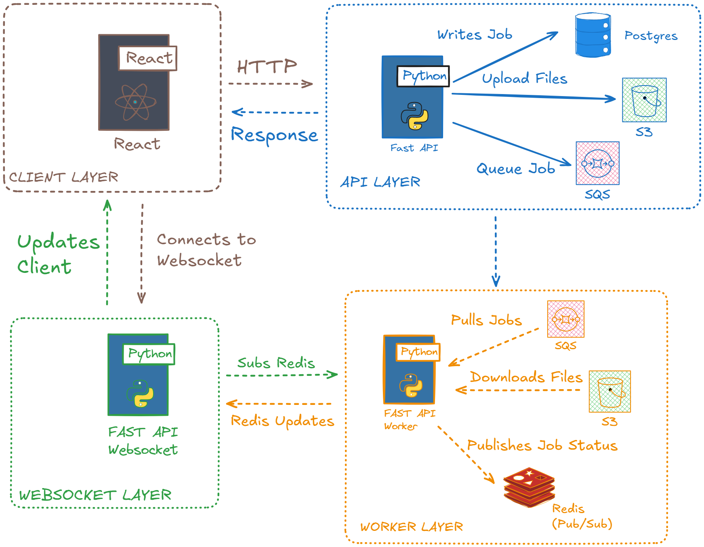

# Asynchronous Document Processing Pipeline - Full Stack App.

This project is a complete full stack application that takes a document, breaks it in to chunks, processes each part with an async pipeline, and streams live upates back to the client side.
It takes care of reload recovery, error handling, and syncing the UI with the backend even if the user closes the tab midway through the pipeline process.

# What the App Does
- You upload a document (PDF/WORD/TEXT) or Custom Text.
- The backend starts a multi step processing pipeline.
- The Text is extracted from the Docs, and split into chunks.
- Each Chunk is summarized using an LLM.
- The Client side receives real time progress via Websockets.
- If you reload the page, the UI "catches up" with the backend by fetching the current state and reconnecting to the right Websocket endpoint.
- Finally all the chunks summaries are combined to form the Document Summary.

# Here is the Main APP flow:

# And here's what happens when you reload during processing:

# Here's a simulated failed pipeline, just to show error handling:

# Project Architecture - Overview

# How These Services Interact with Each Other

- The Client Layer & API Layer
    - Everything starts when a uploads text or documents in the React Application (Client Layer).
    - The React app sends an HTTP request to the Fast API server (API Layer).
    - Processing: The Server does three things:
      - Writes job details to Postgres DB.
      - Uploads any necessary files to S3
      - Adds a job to the SQS queue.
    - The client then receives a confirmation that the request has been received and the pipeline has started.

- The Worker Layer
  - The Fast API Worker pulls the "Job" from SQS to process it.
  - During each stage of the processing, it publishes status updates to Redis.

- The Websocket Layer
  - The client connects to the Websocket Layer.
  - The Fast API Websocket service is subscribed to Redis.
  - As the Worker publishes updates to Redis, the Websocket service receives those updates and pushes them to the client.

# To Run the Project Locally:

# Setting Up AWS SQS (Basic Setup)

- This project only needs a simple SQS queue, nothing complex like dead letter queues or special routing.
- Go to the AWS Console and then SQS.
- Click Create Queue.
- Choose Standard Queue (not FIFO).
- Enter any name.
- Leave all other settings to defaults.
- After the queue is created, copy the Queue URL.
- Create a .env file and copy the keys from the backend/example-env-file.env
- Add the SQS_URL to the .env file
- For more details, please check 
https://docs.aws.amazon.com/AWSSimpleQueueService/latest/SQSDeveloperGuide/welcome.html

# Setting Up AWS S3 (Basic Setup)
- Go to the AWS Console and then S3.
    - Click Create bucket, General Purpose.
    - Name the bucket anything you like (e.g. my-doc-processing-bucket).
    - Pick the same region you used for SQS service.
    - Under Block Public Access settings for this bucket Section
    - Block all public access uncheck: OFF
    - Check Block public access to buckets and objects granted through new ACLs
    - Check Block public access to buckets and objects granted through any ACLs
    - Leave everything as default and click Create Bucket.
    - Copy the Bucket name and add it to backend/.env file for S3_BUCKET_UPLOADS

- Create an IAM User for S3 Access
  - Go to AWS Console, IAM and click on Users.
  - Click Create User, name it something like doc-pipeline-s3-user
  - Select Access key – Programmatic access
  - Attach this AWS managed policy - AmazonS3FullAccess (restrict it later according to your requirements).
  - Download or Copy the keys.
  - In the backend/.env file enter the values for copied keys: AWS Access Key ID, AWS Secret Access Key, AWS_REGION.
- If you want to dive deeper in to Bucket policie or if you facing any issues please read the official S3 documentation at
  https://docs.aws.amazon.com/AmazonS3/latest/userguide/Welcome.html
 

# Running the project with Docker Compose

- This project uses Docker Compose to run all the Services:
  - FastAPI API
  - FastAPI Worker
  - FastAPI WebSocket Service
  - React Frontend
  - Postgres
  - Redis

- Clone the Repository
- To Start Everything
  - docker compose up -d

- View logs for a specific service
  - docker compose logs -f api
  - docker compose logs -f worker
  - docker compose logs -f websocket
  - docker compose logs -f frontend

- To Stop Everything
  - docker compose up -d --build